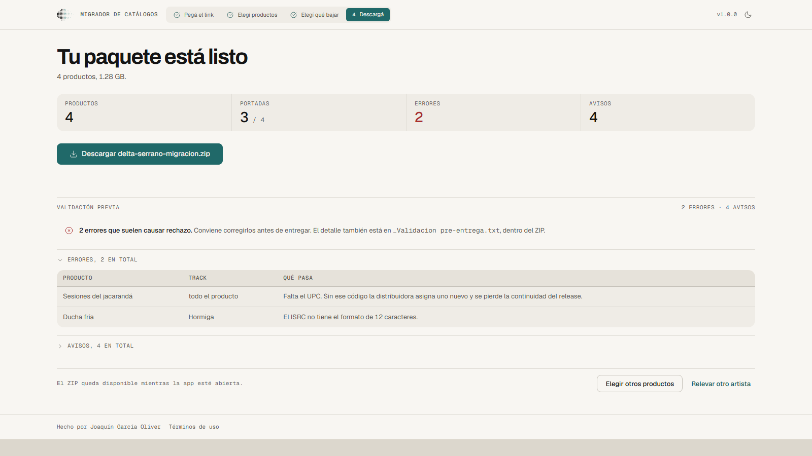

# Catalog Migrator

[Español](README.md) · **English**

Free app that surveys an artist's catalog and prepares it for a move to another
distributor. You paste the YouTube channel link and it gives you back the
**ISRCs**, the **UPCs**, high-resolution **artwork**, a ready-to-load **ingestion
sheet**, and a **pre-delivery validation** that tells you what is going to be
rejected before you send it.

Made by [Joaquín García Oliver](https://www.linkedin.com/in/joaquingarciaoliver/).
Open source and free of charge.


<sub>The screenshots use a sample catalog. The artist, the titles and the codes
are made up, so as not to publish anyone's catalog. They are generated with
`python build/capturas.py` against the real app while it runs, so they cannot go
stale without it showing.</sub>

---

## Download

Go to [Releases](https://github.com/joacogoliver-debug/catalog-migrator/releases)
and grab the file for your system.

### Windows

| | Who it's for |
|---|---|
| `...-windows-completa-instalador.exe` | **The recommended one.** Double click, Next, and it lands in the Start menu with its uninstaller. It does not ask for administrator rights. |
| `...-windows-completa.exe` | The same app as a single file, nothing installed. For a USB stick, or to try it out. |

### macOS and Linux

The experience here is worse than on Windows, and it is better said up front than
discovered by you.

What gets published is **a bare executable, not an `.app` or a `.deb`**. There is
no installer, it does not show up in Launchpad, and double clicking it in Finder
does not do what you expect: it opens a Terminal window. You run it like this,
from the terminal, once per download:

```bash
chmod +x Migrador-de-Catalogos-macos-completa
./Migrador-de-Catalogos-macos-completa
```

On **macOS** it is also unsigned and **not notarized**, so Gatekeeper will block
it the first time. If right click → "Open" is not enough:

```bash
xattr -d com.apple.quarantine Migrador-de-Catalogos-macos-completa
```

Notarizing requires an Apple developer account, which costs money, and this tool
is free. Packaging it as an `.app` is pending and does not depend on money.

On **Linux**, the native window needs GTK and WebKit installed. If they are not
there, the app opens in your default browser and works just the same.

If none of this appeals to you, on macOS and Linux it is easier to run it from
source (see below): two commands and you skip all of the above.

### The two variants

| Variant | What it carries |
|---|---|
| **completa** (full) | Everything, plus the audio module with ffmpeg inside, plus a YouTube key already configured. You open it and it works. |
| **esencial** (essential) | Survey, spreadsheet, validation, ingestion sheet and artwork. Lighter, no ffmpeg and **no bundled key**: you use your own. |

The full variant carries a YouTube Data API key so you don't have to create a
Google Cloud project just to try it out. It is a shared key, with a shared daily
quota, restricted to YouTube Data API v3 and capped. **Anyone who downloads the
binary can extract it**, and that is stated here because it is the truth: if you
would rather not depend on that, download the `esencial` variant, or load your
own from the app under "I'd rather use my own key".

### Your system is going to say the program is "unrecognized"

That is expected and does not mean anything is wrong. The binary is **not
signed**, because a signing certificate costs money per year and this tool is
free. How to go on:

- **Windows**: "More info" → "Run anyway".
- **macOS**: right click → "Open", or Settings → Privacy & Security →
  "Open Anyway".

Instead of a paid signature, trust rests on three verifiable things: the code is
public, **the executable is compiled here in GitHub Actions** from that code in
plain sight, and every release publishes the SHA256 plus a provenance
attestation. You can verify that the binary came out of this repo:

```bash
gh attestation verify Migrador-de-Catalogos-windows-completa.exe --repo joacogoliver-debug/catalog-migrator
```

It is the same stance `yt-dlp` takes.

---

## Language

The app is in **Spanish and English**, all of it: the interface, the survey log,
the error messages, and also what you download — the names of the files inside
the ZIP, the spreadsheet headers and the validation report.

The Windows installer asks for the language on its first screen and the app
starts in whichever one you picked. After that you can switch any time from the
selector in the header, with nothing to restart.

Running from source, the language comes from the first of these that exists: the
`MIGRADOR_IDIOMA` variable (`es` or `en`), the last one you picked in the app,
whatever the installer left behind, and failing that, the operating system's
language.

```bash
MIGRADOR_IDIOMA=en python app/launcher.py
```

---

## How it's used

**1. You paste the link** of the artist's channel, Topic or `@handle`.


**2. You choose what to migrate.** The catalog shows up grouped into products
(album / EP / single). You can tick them one by one, filter by year range or by
distributor, or search by title, ISRC or UPC. Each product can be expanded to see
its tracks.


**3. You choose what to download**: spreadsheet and validation, artwork, and
audio if you enabled that module.


**4. You download a ZIP** organized with one folder per product.

```
Artist - Migration 2026-09-14/
├── _Pre-delivery validation.txt   ← start here
├── _Ingestion sheet.csv           ← the file you load into the distributor
├── _Full catalog.xlsx
├── _Migration report.txt
├── _READ ME.txt
└── 2013 - Random Access Memories [886443919259]/
    ├── cover.jpg
    └── data.xlsx
```



One folder per product, because in a migration each release is delivered as a
unit: one UPC, one cover, its data. That way each folder is already good to
upload, and the UPC in the name keeps an album from being confused with its
reissue.

## The pre-delivery validation

This is the part that saves the most time. It separates what causes a rejection
from what merely deserves a look.

**Errors** (the distributor rejects these)
- ISRC with an invalid format
- UPC with a wrong check digit or the wrong length
- ISRC repeated across tracks, or UPC repeated across products
- Cover not square, below 1400×1400, or in CMYK
- Release year in the future or impossible
- Track with no title or no duration

**Warnings** (these pass ingestion, worth a look)
- A missing ISRC or UPC: a new one is going to be assigned and you lose the
  recording's history or the release's continuity
- The title drags YouTube text along (`(Official Video)`, `[Lyric Video]`…)
- Track order is estimated and not confirmed
- The label (℗) is missing
- The cover passes but is below the recommended 3000×3000

Codes are validated by their real rules: 12-character ISRC format and the GTIN
check digit for UPC-A and EAN-13.

## Where the data comes from

| Data | Source | Needs a key |
|---|---|---|
| Catalog, distributor, label, year, plays | YouTube Data API | yes |
| ISRC and UPC | [Deezer](https://developers.deezer.com/api) | no |
| Artwork | [iTunes Search API](https://performance-partners.apple.com/search-api) | no |

Artwork is requested at 3000×3000, but **the resolution Apple actually returned
is the one reported**, not the one requested: Apple serves the largest it has for
that release and answers with it even when it is smaller. If we claimed 3000×3000
about a 600×600 cover, the spreadsheet would state that it meets the ingestion
minimum when in fact it is going to be rejected.

## What it does NOT do

- **It does not generate DDEX ERN.** Emitting valid ERN requires being a
  registered DDEX party with an identifier of your own, so an "almost DDEX" XML
  would be rejected anyway while giving the false impression of being ready.
  Instead we generate a CSV with the standard columns that nearly every
  distributor accepts or maps.
- **It does not invent metadata.** Whatever cannot come from public sources
  (genre, explicit, composers, publishers, © line) is marked `<<COMPLETAR>>` in
  the ingestion sheet, not left blank and not filled in by eye.
- **It does not guess the track number.** YouTube does not expose it: the order is
  estimated from the upload date and flagged as unconfirmed.
- **It does not know the release format.** Single / EP / album is inferred from
  the track count (1-3 / 4-6 / 7+), which is the distributors' convention but is
  still a heuristic.

## Privacy

- **There are no accounts, no sign-up and no server of ours.** The app runs
  entirely on your machine: it raises a local server on `127.0.0.1` that is not
  exposed to the network and that, on top of it, demands its own session token on
  every request, so no page open in your browser can talk to it.
- **Your API key stays on your computer**, it is never sent anywhere other than
  Google.
- **The catalog is not stored.** It lives in memory while the app is open.
- Deezer and iTunes are queried with public catalog data (artist name, title,
  duration).
- There is no telemetry of any kind.

## Terms of use

This tool is for **catalog administration**: surveying, documenting and migrating
material you own or administer with the rights holder's authorization. **It
neither endorses nor enables piracy.** The audio module ships disabled, is
optional, and requires your own paid account.

The detail is in [TERMS.md](TERMS.md). The app shows the terms the first time it
opens and keeps them reachable from the foot of the window.

---

## Running it from source

```bash
pip install -r requirements-app.txt
python app/launcher.py
```

On Windows you can use `abrir_app.bat`; on macOS/Linux, `./abrir_app.sh`. Both
install the dependencies the first time.

The app opens in **its own window**, not in the browser: it uses `pywebview` over
the system web engine (WebView2 on Windows, WebKit on macOS). If for some reason
it cannot, it falls back to the system engine in app mode —its own window, no
address bar and no tabs— and if that fails too, to the browser. `--diagnostico`
writes a report of what the app can do on that machine, useful because the
executable is compiled without a console.

### Building

```bash
pip install pyinstaller
python build/build.py --con-audio                 # full variant
python build/build.py                             # essential variant
python build/build.py --con-audio --instalador    # and the Windows installer
```

It runs the tests, packages with [build/migrador.spec](build/migrador.spec) and
leaves the binary and its SHA256 in `dist/`. The installer needs
[Inno Setup 6](https://jrsoftware.org/isinfo.php)
(`winget install --id JRSoftware.InnoSetup -e`).

To embed a YouTube key in the binary, `--con-clave`. The key comes from the
`MIGRADOR_CLAVE_YT` variable or from your local config, **never from a file in
the repository**. In CI it comes from a GitHub secret.

The icon is generated from code with `python build/icono.py`, out of the logo in
`docs/marca`. It uses the **compact variant** of the symbol and not the full
halftone: at 74 dots the logo is very good from 32 px up and a gray smudge below
that, and an application icon is seen at 16, 24 and 32 nearly all of the time.

### Audio module (optional, off by default)

The app can also download the audio, but it **does not ship enabled** in the
essential variant, and its dependencies are **not inside that executable**, on
purpose. From source:

```bash
pip install -r requirements-audio.txt   # tiddl + yt-dlp
# and ffmpeg on the PATH: https://ffmpeg.org/download.html
MIGRADOR_AUDIO=1 python app/launcher.py
```

It works at two levels, and every file is labeled by what it actually is:

| Level | Source | Format | Fit for delivery? |
|---|---|---|---|
| A | Tidal, with **your own** paid account | lossless FLAC | yes |
| B | YouTube | Opus / M4A | **no**, reference only |

Two things that matter:

- **YouTube audio is lossy and it cannot be fixed.** YouTube re-encodes
  everything that is uploaded to it. Converting it to WAV multiplies the weight
  without recovering anything, so the app keeps the original stream instead of
  faking quality.
- **The real codec of every file is verified**, not the quality that was asked
  for. Tidal can serve AAC for recordings without a lossless master even when
  LOSSLESS is requested. Anything that is not FLAC gets flagged in the
  spreadsheet, in the file name (`[REFERENCE-LOSSY]`) and in the report.

For a formal delivery the right thing is still the artist's or the label's
**original master**. This is a fallback for when that file does not turn up.

If you connect Tidal, the login is device-code: the app sends you to Tidal's own
site and **your password never passes through here**. The token lives only in the
session and is erased when it closes; of the profile, only the user ID and the
country are kept.

---

## How it's built

No frameworks and no build step, so that packaging is copying files:

- **Backend**: `http.server` from the standard library. It is a local,
  single-user app, so neither ASGI nor workers are needed, and in exchange the
  executable does not depend on uvicorn's dynamic imports, which are the usual
  reason a binary works in development and fails once packaged.


- **Frontend**: vanilla JavaScript and CSS over the tokens in `app/web/tokens/`,
  which follow [DESIGN.en.md](docs/DESIGN.en.md). No CDN, not even for the typefaces:
  the three `.woff2` travel inside (56 KB in total), so the app looks the same
  with no internet.
- **Long jobs** (surveying, packaging) run in threads with progress and
  cancellation; the frontend polls their state every 400 ms.

| File | What it does |
|---|---|
| `app/launcher.py` | Entry point: free port, server, window or browser |
| `app/server.py` | JSON API, static file server and the local API's defenses |
| `app/jobs.py` | Background jobs with progress and cancellation |
| `app/web/` | The interface (html, css, js) |
| `app/web/tokens/` | Palette, typography, spacing and shape |
| `app/web/fonts/` | Public Sans and DM Mono, hosted locally |
| `i18n.py`, `app/web/i18n.js` | The two translation catalogs, one per process |
| `docs/marca/` | The logotype and its rules of use |
| `migrar_core.py` | Orchestrates the 4 steps |
| `relevar_core.py` | YouTube survey + ISRC/UPC via Deezer |
| `productos.py` | Groups tracks into products and filters the selection |
| `validar.py` | Pre-delivery validation |
| `portadas.py` | Artwork via the iTunes Search API |
| `paquete.py` | Spreadsheets, ingestion sheet, reports and ZIP |
| `audio.py` | Optional audio module |
| `build/` | Packaging, installer, icon and screenshots |
| `tests/` | The ten tests, no network and no keys |
| `docs/` | The product and design decisions |

### On the local server's security

Listening only on `127.0.0.1` is not enough: any page open in that same machine's
browser can send requests to localhost. That is why there are two further
defenses, both cheap and both with a test of their own:

1. **Session token.** A new one is generated at every startup, injected into
   `index.html`, and every `/api/` route demands it. An external page cannot read
   it, because the origin is a different one.
2. **`Host` check.** Only `127.0.0.1` or `localhost` are accepted, which cuts off
   DNS rebinding, the classic way around the previous defense.

On top of that, the page declares a CSP that does not let it request anything
outside, which is consistent with an app that works with no internet.

## Tests

They run with no network, no keys and without the audio dependencies:

```bash
python tests/test_i18n.py                # both translation catalogs, complete and in agreement
python tests/test_parse_description.py   # parsing of YouTube descriptions
python tests/test_productos.py           # grouping into products + filters
python tests/test_validar.py             # validation of codes, artwork and duplicates
python tests/test_portadas.py            # real artwork resolution
python tests/test_paquete.py             # ZIP structure + quality labeling
python tests/test_app.py                 # backend: jobs, HTTP, token and Host
python tests/test_migrar_core.py         # orchestrator contract
python tests/test_errores_youtube.py     # translation of YouTube Data API errors
python tests/test_audio_tidal.py         # tiddl contract (skipped if it is absent)
```

CI runs them on every push, deliberately **without** installing
`tiddl`/`yt-dlp`/`ffmpeg`, to verify that the core does not depend on them.

The linter runs before the tests, with the same rules as on the author's
machine:

```bash
pip install ruff
ruff check .
```

The configuration is in [pyproject.toml](pyproject.toml). Four rule families
(`E`, `F`, `W`, `B`) and no more: the opinion families find little and generate
a lot of noise, and a linter that warns about things nobody is going to fix
ends up ignored.

## Credits

- The technique for requesting high-resolution artwork from Apple's CDN comes
  from [`fchavonet/full_stack-itunes_artwork_finder`](https://github.com/fchavonet/full_stack-itunes_artwork_finder).
- The optional lossless audio module uses
  [`oskvr37/tiddl`](https://github.com/oskvr37/tiddl) (Apache 2.0) as a library.
- Typefaces [Public Sans](https://github.com/uswds/public-sans) and
  [DM Mono](https://github.com/googlefonts/dm-mono), both under the SIL Open Font
  License 1.1.
- The interface icons are traced by hand from [Lucide](https://lucide.dev) (ISC
  license). The app declares a CSP that does not allow requesting anything from
  outside, so a CDN library was ruled out, and pulling in a whole one for thirteen
  glyphs did not justify itself.
- The full variant includes [FFmpeg](https://ffmpeg.org) (GPLv3), unmodified and
  as a separate program.

## License

MIT — see [LICENSE](LICENSE). The intended use and its limits are in
[TERMS.md](TERMS.md).

This tool is for catalog owners to survey and migrate **their own** material.
Each user is responsible for holding the rights to the content they process and
for complying with the terms of the services it queries.
