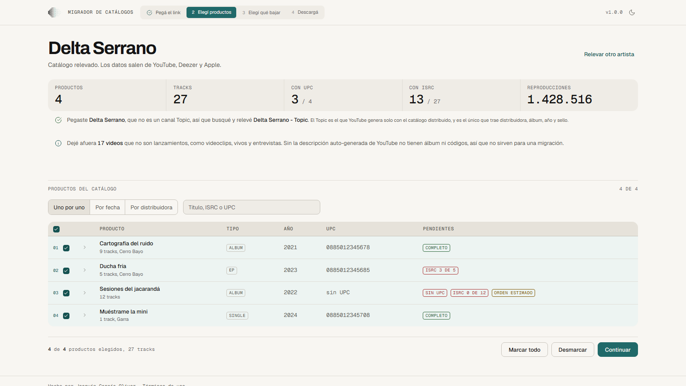
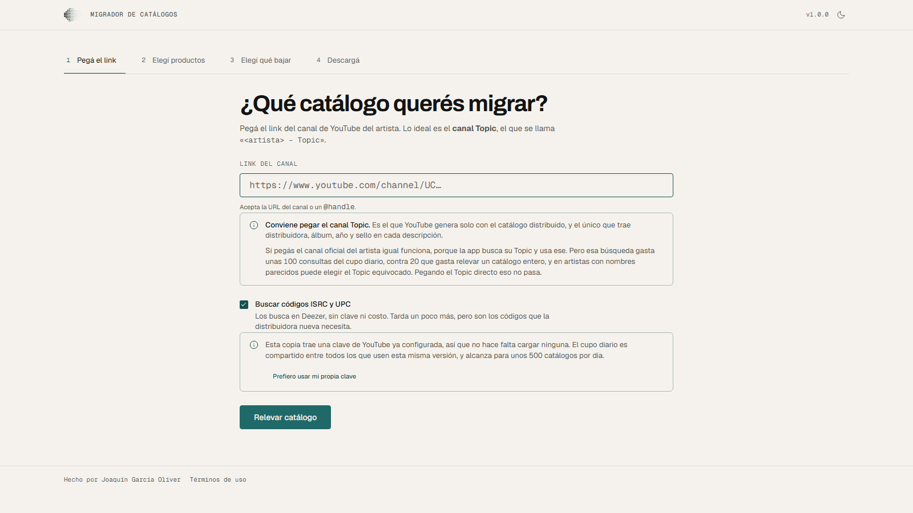
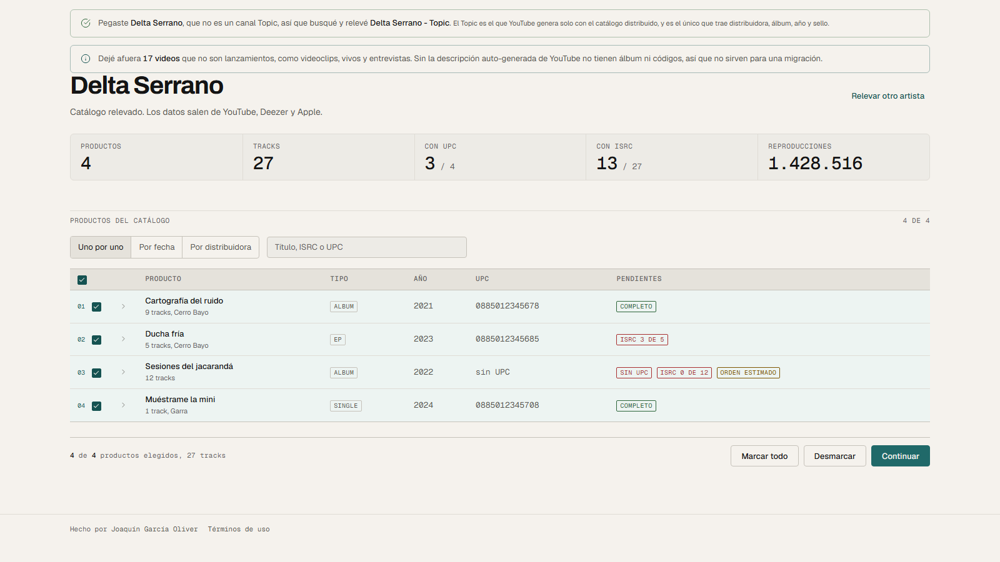
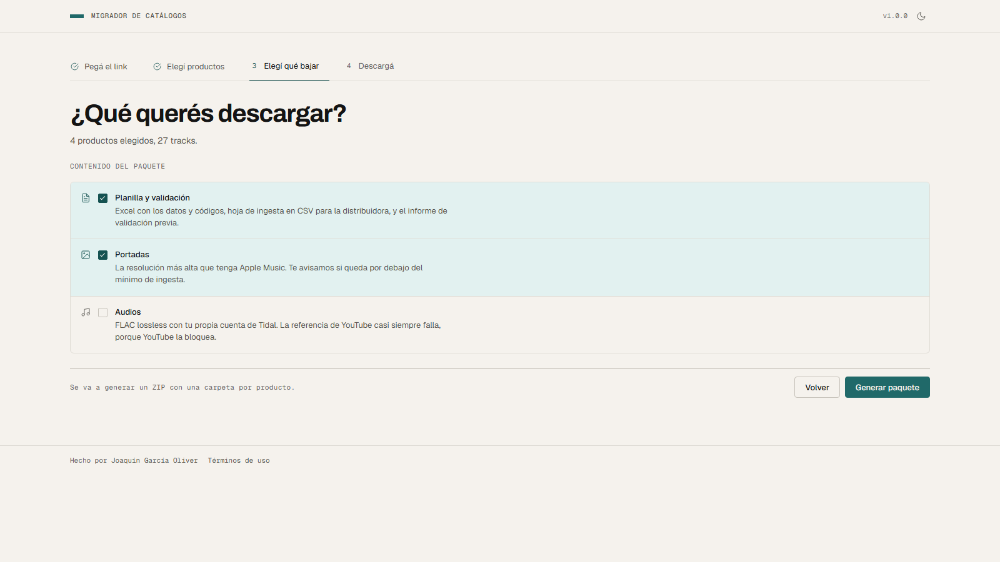
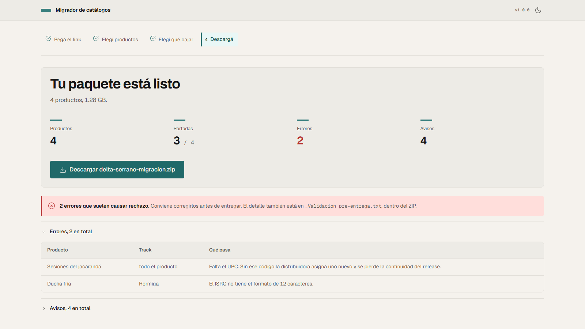
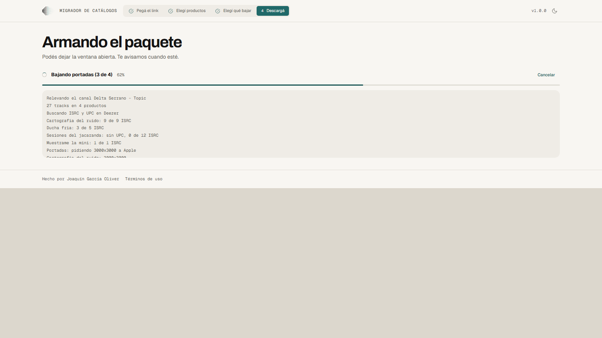

# Migrador de Catálogos

**Español** · [English](README.en.md)

App gratuita para relevar el catálogo de un artista y preparar su migración a
otra distribuidora. Pegás el link del canal de YouTube y te devuelve los
**ISRC**, los **UPC**, las **portadas** en alta resolución, una **hoja de
ingesta** lista para cargar y una **validación pre-entrega** que te dice qué va a
ser rechazado antes de que lo mandes.

Hecha por [Joaquín García Oliver](https://www.linkedin.com/in/joaquingarciaoliver/).
Código abierto y sin costo.




<sub>Las capturas usan un catálogo de ejemplo. El artista, los títulos y los
códigos son inventados, para no publicar el catálogo de nadie. Se generan con
`python build/capturas.py` sobre la app real corriendo, así que no pueden quedar
desactualizadas sin que se note. Las de la versión en inglés salen del mismo
comando con `MIGRADOR_IDIOMA=en` y `--salida docs/capturas/en`.</sub>

---

## Descargar

Andá a [Releases](https://github.com/joacogoliver-debug/catalog-migrator/releases)
y bajá el archivo de tu sistema.

### Windows

| | Para quién |
|---|---|
| `...-windows-completa-instalador.exe` | **La recomendada.** Doble clic, Siguiente, y queda en el menú Inicio con su desinstalador. No pide permisos de administrador. |
| `...-windows-completa.exe` | La misma app en un solo archivo, sin instalar nada. Para un pendrive o para probarla. |

### macOS

Hay **dos archivos y no son intercambiables**, porque un ejecutable sirve para la
arquitectura en la que se compiló y para ninguna otra:

| Si tu Mac tiene | Bajá |
|---|---|
| Chip **Apple** (M1, M2, M3, M4…) | `...-macos-apple-silicon-completa` |
| Procesador **Intel** | `...-macos-intel-completa` |

Para saber cuál tenés: menú  → "Acerca de esta Mac". Si bajás el que no es, la
Terminal responde `bad CPU type in executable`, que no explica nada.

Hay una [guía paso a paso para macOS](docs/INSTALAR-MAC.md) pensada para alguien
que no usa la Terminal todos los días.

Lo que se publica es **un ejecutable suelto, no un `.app`**. No hay instalador,
no aparece en el Launchpad y doble clic en el Finder no hace lo que esperás.
Se corre desde la Terminal, una vez por descarga:

```bash
cd ~/Downloads
chmod +x Migrador-de-Catalogos-macos-apple-silicon-completa
xattr -c Migrador-de-Catalogos-macos-apple-silicon-completa
./Migrador-de-Catalogos-macos-apple-silicon-completa
```

La línea del `xattr` saca la marca de cuarentena que macOS le pone a todo lo que
se baja de internet. Hace falta porque el binario está **sin firmar y sin
notarizar**, y si no, Gatekeeper lo bloquea. Se usa `-c` y no `-d
com.apple.quarantine` a propósito: `-d` falla con `No such xattr` cuando la marca
no está, y ese error asusta sin motivo.

Notarizar requiere la cuenta de desarrollador de Apple, que es paga, y esta
herramienta es gratis. Empaquetarlo como `.app` sí está pendiente y no depende
de plata.

### Linux

También es un ejecutable suelto, no un `.deb`. La ventana nativa necesita GTK y
WebKit instalados; si no están, la app se abre en tu navegador por defecto y
funciona igual.

```bash
chmod +x Migrador-de-Catalogos-linux-completa
./Migrador-de-Catalogos-linux-completa
```

Si nada de esto te cierra, en macOS y Linux conviene correrla desde el código
(ver más abajo): son dos comandos y te evitás todo lo anterior.

### Las dos variantes

| Variante | Qué trae |
|---|---|
| **completa** | Todo, más el módulo de audio con ffmpeg adentro, más una clave de YouTube ya configurada. Se abre y funciona. |
| **esencial** | Relevamiento, planilla, validación, hoja de ingesta y portadas. Más liviana, sin ffmpeg y **sin clave incluida**: usás la tuya. |

La variante completa trae una clave de la YouTube Data API para que no tengas que
crear un proyecto en Google Cloud sólo para probarla. Es una clave compartida,
con cupo diario compartido, restringida a la YouTube Data API v3 y con tope de
cuota. **Cualquiera que baje el binario la puede extraer**, y está dicho acá
porque es la verdad: si preferís no depender de eso, bajá la variante `esencial`,
o cargá la tuya desde la app en «Prefiero usar mi propia clave».

### El sistema va a decir que el programa "no es reconocido"

Es esperable y no significa que haya algo mal. El binario **no está firmado**
porque un certificado de firma cuesta plata por año y esta herramienta es gratis.
Cómo seguir:

- **Windows**: "Más información" → "Ejecutar de todas formas".
- **macOS**: clic derecho → "Abrir", o Configuración → Privacidad y seguridad →
  "Abrir de todos modos".

En vez de una firma paga, la confianza se apoya en tres cosas verificables: el
código es público, **el ejecutable se compila acá en GitHub Actions** desde ese
código a la vista de todos, y cada release publica el SHA256 más una atestación
de procedencia. Podés verificar que el binario salió de este repo:

```bash
gh attestation verify Migrador-de-Catalogos-windows-completa.exe --repo joacogoliver-debug/catalog-migrator
```

Es la misma postura que usa `yt-dlp`.

---

## Idioma

La app está en **castellano y en inglés**, entera: la interfaz, el log del
relevamiento, los mensajes de error, y también lo que se descarga (los nombres
de los archivos del ZIP, los encabezados de la planilla y el informe de
validación).

El instalador de Windows pregunta el idioma en la primera pantalla y la app
arranca en el que hayas elegido. Después se puede cambiar cuando quieras desde
el selector del encabezado, sin reiniciar nada.

Corriendo desde el código, el idioma sale de la primera de estas cosas que
exista: la variable `MIGRADOR_IDIOMA` (`es` o `en`), lo último que hayas elegido
en la app, lo que dejó el instalador, y si no, el idioma del sistema
operativo.

```bash
MIGRADOR_IDIOMA=en python app/launcher.py
```

---

## Cómo se usa

**1. Pegás el link** del canal, Topic o `@handle` del artista.



**2. Elegís qué productos migrar.** El catálogo aparece agrupado en productos
(álbum / EP / single). Podés marcarlos uno por uno, filtrar por rango de años,
por distribuidora, o buscar por título, ISRC o UPC. Cada producto se puede
desplegar para ver sus tracks.



**3. Elegís qué descargar**: planilla y validación, portadas, y audios si
activaste ese módulo.



**4. Descargás un ZIP** organizado con una carpeta por producto.



```
Artista - Migracion 2026-09-14/
├── _Validacion pre-entrega.txt    ← empezá por acá
├── _Hoja de ingesta.csv           ← el archivo para cargar en la distribuidora
├── _Catalogo completo.xlsx
├── _Reporte de migracion.txt
├── _LEEME.txt
└── 2013 - Random Access Memories [886443919259]/
    ├── portada.jpg
    └── datos.xlsx
```

Es una carpeta por producto porque en una migración cada release se entrega como
una unidad: un UPC, una portada, sus datos. Así cada carpeta ya queda lista para
subir, y el UPC en el nombre evita confundir un álbum con su reedición.

## La validación pre-entrega

Es la parte que más tiempo ahorra. Separa lo que causa rechazo de lo que sólo
conviene revisar.

**Errores** (la distribuidora los rechaza)
- ISRC con formato inválido
- UPC con dígito verificador incorrecto o largo equivocado
- ISRC repetido entre tracks, o UPC repetido entre productos
- Portada no cuadrada, por debajo de 1400×1400, o en CMYK
- Año de lanzamiento en el futuro o imposible
- Track sin título o sin duración

**Avisos** (pasan la ingesta, conviene mirarlos)
- Falta un ISRC o un UPC: se va a asignar uno nuevo y se pierde el historial de
  la grabación o la continuidad del release
- El título arrastra texto de YouTube (`(Official Video)`, `[Lyric Video]`…)
- El orden de los tracks es estimado y no está confirmado
- Falta el sello (℗)
- La portada entra pero está por debajo de los 3000×3000 recomendados

Los códigos se validan por sus reglas reales: formato ISRC de 12 caracteres y
dígito verificador GTIN de UPC-A y EAN-13.

## De dónde salen los datos

| Dato | Fuente | Necesita clave |
|---|---|---|
| Catálogo, distribuidora, sello, año, reproducciones | YouTube Data API | sí |
| ISRC y UPC | [Deezer](https://developers.deezer.com/api) | no |
| Portadas | [iTunes Search API](https://performance-partners.apple.com/search-api) | no |

Las portadas se piden en 3000×3000, pero **se reporta la resolución que Apple
efectivamente devolvió**, no la que pedimos: Apple sirve el máximo que tiene para
ese release y responde igual aunque sea más chico. Si dijéramos 3000×3000 sobre
una portada de 600×600, la planilla afirmaría que cumple el mínimo de ingesta
cuando en realidad la van a rechazar.

## Qué NO hace

- **No genera DDEX ERN.** Emitir ERN válido requiere ser una parte registrada de
  DDEX con identificador propio, así que un XML "casi DDEX" se rechazaría igual
  dando falsa sensación de que está listo. En su lugar generamos un CSV con las
  columnas estándar que aceptan o mapean casi todas las distribuidoras.
- **No inventa metadata.** Lo que no puede salir de fuentes públicas (género,
  explicit, compositores, editoriales, línea ©) queda marcado `<<COMPLETAR>>` en
  la hoja de ingesta, no vacío ni rellenado a ojo.
- **No adivina el número de track.** YouTube no lo expone: el orden se estima por
  fecha de subida y se marca como no confirmado.
- **No sabe el formato del release.** Single / EP / álbum se deduce de la cantidad
  de tracks (1-3 / 4-6 / 7+), que es la convención de las distribuidoras pero
  sigue siendo una heurística.

## Privacidad

- **No hay cuentas, registro ni servidor nuestro.** La app corre entera en tu
  máquina: levanta un servidor local en `127.0.0.1` que no queda expuesto en la
  red, y que además exige un token de sesión propio en cada pedido, así ninguna
  página abierta en tu navegador puede hablarle.
- **Tu clave de la API queda en tu computadora**, nunca se manda a ningún lado
  que no sea Google.
- **No se guarda el catálogo.** Vive en memoria mientras la app está abierta.
- Deezer e iTunes se consultan con datos públicos del catálogo (nombre de
  artista, título, duración).
- No hay telemetría de ningún tipo.

## Términos de uso

Esta herramienta es para **administración de catálogos**: relevar, documentar y
migrar material propio o administrado con autorización del titular. **No avala ni
habilita la piratería.** El módulo de audio viene desactivado, es opcional y
requiere tu propia cuenta paga.

El detalle está en [TERMINOS.md](TERMINOS.md). La app los muestra la primera vez
que se abre y los deja siempre accesibles desde el pie de la ventana.

---

## Correrla desde el código

```bash
pip install -r requirements-app.txt
python app/launcher.py
```

No hace falta instalar nada del proyecto para eso. Si preferís tenerlo instalado,
también se puede, y ahí los extras dicen qué trae cada cosa:

```bash
pip install -e ".[app]"           # la app
pip install -e ".[app,audio]"     # y el módulo de audio
pip install -e ".[app,dev]"       # y las herramientas de desarrollo
```

En Windows podés usar `scripts/abrir_app.bat`; en macOS y Linux,
`./scripts/abrir_app.sh`. Los dos instalan las dependencias la primera vez.

La app abre en **su propia ventana**, no en el navegador: usa `pywebview` sobre
el motor web del sistema (WebView2 en Windows, WebKit en macOS). Si por algo no
puede, cae al motor del sistema en modo aplicación —ventana propia, sin barra de
direcciones ni pestañas—, y si tampoco, al navegador. `--diagnostico` escribe un
reporte de qué puede hacer la app en esa máquina, útil porque el ejecutable se
compila sin consola.

### Compilar

```bash
pip install pyinstaller
python build/build.py --con-audio                 # variante completa
python build/build.py                             # variante esencial
python build/build.py --con-audio --instalador    # y el instalador de Windows
```

Corre los tests, empaqueta con [build/migrador.spec](build/migrador.spec) y deja
el binario y su SHA256 en `dist/`. El instalador necesita
[Inno Setup 6](https://jrsoftware.org/isinfo.php)
(`winget install --id JRSoftware.InnoSetup -e`).

Para incluir una clave de YouTube en el binario, `--con-clave`. La clave sale de
la variable `MIGRADOR_CLAVE_YT` o de tu config local, **nunca de un archivo del
repositorio**. En el CI viene de un secreto de GitHub.

Las notas del release salen del CHANGELOG, no se escriben a mano:
`python build/notas_release.py` las arma en los dos idiomas y **aborta si el
CHANGELOG no tiene una entrada para la versión que se está publicando**. El
workflow las usa al empujar un tag.

El icono se genera desde código con `python build/icono.py`, a partir del logo
de `docs/marca`. Usa la **variante compacta** del símbolo y no el semitono
completo: con 74 puntos el logo es muy bueno de 32 px para arriba y una mancha
gris por debajo, y un icono de aplicación se ve casi siempre a 16, 24 y 32.

### Módulo de audio (opcional, apagado por defecto)

La app puede además bajar los audios, pero **no viene activado** en la variante
esencial y sus dependencias **no están adentro de ese ejecutable** a propósito.
Desde el código:

```bash
pip install -r requirements-audio.txt   # tiddl + yt-dlp
# y ffmpeg en el PATH: https://ffmpeg.org/download.html
MIGRADOR_AUDIO=1 python app/launcher.py
```

Funciona en dos niveles, y cada archivo queda etiquetado por lo que realmente es:

| Nivel | Fuente | Formato | ¿Apto para entrega? |
|---|---|---|---|
| A | Tidal, con **tu propia** cuenta paga | FLAC lossless | sí |
| B | YouTube | Opus / M4A | **no**, sólo referencia |

Dos cosas que importan:

- **El audio de YouTube es lossy y no se puede arreglar.** YouTube recodifica
  todo lo que se sube. Pasarlo a WAV multiplica el peso sin recuperar nada, así
  que la app guarda el stream original en vez de fingir calidad.
- **Se verifica el codec real de cada archivo**, no la calidad pedida. Tidal
  puede servir AAC para grabaciones sin máster lossless incluso cuando se pide
  LOSSLESS. Todo lo que no sea FLAC queda marcado en la planilla, en el nombre
  del archivo (`[REFERENCIA-LOSSY]`) y en el reporte.

Para una entrega formal lo correcto sigue siendo el **máster original** del
artista o del sello. Esto es un respaldo para cuando ese archivo no aparece.

Si conectás Tidal, el login es por device-code: la app te manda al sitio de Tidal
y **tu contraseña nunca pasa por acá**. El token vive sólo en la sesión y se borra
al cerrarla; del perfil se guarda únicamente el ID de usuario y el país.

---

## Cómo está hecha

Sin frameworks ni build step, para que empaquetar sea copiar archivos:

- **Backend**: `http.server` de la biblioteca estándar. Es una app local de un
  usuario, así que no hacen falta ASGI ni workers, y a cambio el ejecutable no
  depende de los imports dinámicos de uvicorn, que son la causa habitual de que
  un binario ande en desarrollo y falle empaquetado.



- **Frontend**: JavaScript vanilla y CSS sobre los tokens de `app/web/tokens/`,
  que siguen a [DESIGN.md](docs/DESIGN.md). Nada de CDN, ni siquiera para las
  tipografías: los tres `.woff2` viajan adentro (56 KB en total), así la app se
  ve igual sin internet.
- **Trabajos largos** (relevar, empaquetar) corren en hilos con progreso y
  cancelación; el frontend consulta el estado cada 400 ms.

El motor es el paquete `migrador`, que vive en `src/` y no sabe nada de HTTP
ni de ventanas. `app/` es la app de escritorio y lo consume. La flecha va en
un solo sentido, y por eso el núcleo se puede probar sin levantar un servidor.

| Archivo | Qué hace |
|---|---|
| `app/launcher.py` | Punto de entrada: puerto libre, servidor, ventana o navegador |
| `app/server.py` | API JSON, servidor de estáticos y las defensas de la API local |
| `app/jobs.py` | Trabajos en segundo plano con progreso y cancelación |
| `app/web/` | La interfaz (html, css, js) |
| `app/web/tokens/` | Paleta, tipografía, espaciado y forma |
| `app/web/fonts/` | Public Sans y DM Mono, hospedadas localmente |
| `src/migrador/i18n.py`, `app/web/i18n.js` | Los dos catálogos de traducción, uno por proceso |
| `docs/marca/` | El logotipo y sus reglas de uso |
| `src/migrador/version.py` | La versión, escrita en un solo lugar |
| `src/migrador/contratos.py` | La forma de los datos que viajan entre los módulos |
| `src/migrador/texto.py` | Normalización de texto y nombres de archivo |
| `src/migrador/migrar_core.py` | Orquesta los 4 pasos |
| `src/migrador/relevar_core.py` | Relevamiento de YouTube + ISRC/UPC por Deezer |
| `src/migrador/productos.py` | Agrupa tracks en productos y filtra la selección |
| `src/migrador/validar.py` | Validación pre-entrega |
| `src/migrador/portadas.py` | Portadas vía iTunes Search API |
| `src/migrador/paquete.py` | Planillas, hoja de ingesta, reportes y ZIP |
| `src/migrador/audio.py` | Módulo de audio opcional |
| `build/` | Empaquetado, instalador, icono y capturas |
| `tests/` | La suite de pytest, sin red y sin claves |
| `docs/` | Las decisiones de producto y de diseño |

### Sobre la seguridad del servidor local

Escuchar sólo en `127.0.0.1` no alcanza: cualquier página abierta en el navegador
de esa misma máquina puede mandarle pedidos a localhost. Por eso hay tres
defensas más, las tres baratas y las tres con test propio:

1. **Token de sesión.** Se genera uno nuevo en cada arranque, se inyecta en
   `index.html` y toda ruta `/api/` lo exige. Una página externa no lo puede
   leer, porque el origen es distinto.
2. **Control de `Host`.** Se acepta sólo `127.0.0.1` o `localhost`, lo que corta
   el rebinding de DNS, que es la vuelta clásica para saltear lo anterior.
3. **CSP.** La página no puede pedir ni ejecutar nada de afuera. Las dos
   primeras cortan a quien quiera entrar; ésta corta lo contrario, porque el
   contenido que la app muestra viene de YouTube, de Deezer y de Apple, y un
   título con HTML adentro no tiene que poder traer un script ni llamar a ningún
   lado. Los scripts inline quedan prohibidos, y por eso hasta el que elige el
   tema vive en su propio archivo.

Es además consistente con una app que funciona sin internet: las tipografías y
todo lo demás salen de este mismo servidor, y el test verifica las dos cosas, que
la cabecera esté entera y que la página no la incumpla.

## Tests

Corren sin red, sin claves y sin las dependencias de audio:

```bash
pip install -r requirements-dev.txt
pytest -q
```

Y con la cobertura, que tiene un umbral en `pyproject.toml` y hace fallar el
build si baja:

```bash
pytest -q --cov
```

| Archivo | Qué cubre |
|---|---|
| `tests/conftest.py` | Las fixtures compartidas, el catálogo de ejemplo y el idioma fijado |
| `tests/test_i18n.py` | Los dos catálogos de traducción, completos y de acuerdo |
| `tests/test_parse_description.py` | Parseo de las descripciones de YouTube |
| `tests/test_productos.py` | Agrupación en productos y filtros |
| `tests/test_texto.py` | Normalización de texto, y que no se vuelva a duplicar |
| `tests/test_contrato_apis.py` | Contrato con Deezer e iTunes, contra respuestas reales grabadas |
| `tests/test_dependencias.py` | Que los extras y los requirements pidan lo mismo |
| `tests/test_notas_release.py` | Las notas del release que salen del CHANGELOG |
| `tests/test_validar.py` | Validación de códigos, portadas y duplicados |
| `tests/test_portadas.py` | Resolución real de las portadas |
| `tests/test_paquete.py` | Estructura del ZIP y etiquetado de calidad |
| `tests/test_app.py` | Backend, trabajos, HTTP, y las tres defensas |
| `tests/test_migrar_core.py` | Contrato del orquestador |
| `tests/test_errores_youtube.py` | Traducción de los errores de la YouTube Data API |
| `tests/test_audio_tidal.py` | Contrato con tiddl, se saltea si no está instalado |

CI los corre en cada push, a propósito **sin** instalar `tiddl`/`yt-dlp`/`ffmpeg`,
para verificar que el núcleo no dependa de ellos. `build/build.py` corre la misma
suite antes de empaquetar y aborta si algo falla.

Los tests de contrato contra Deezer e iTunes no inventan las respuestas: leen las que
esas APIs dieron de verdad, guardadas en `tests/fixtures/` con la URL y la
fecha de cuándo se grabaron. Se vuelven a tomar con
`python build/grabar_fixtures.py`, que es **lo único del repositorio que toca
la red**. Si después de regrabarlas un test se cae, la pregunta es qué cambió
en la API, no cómo actualizar el archivo.

### Antes de commitear

```bash
pre-commit install     # una sola vez
```

A partir de ahí, cada commit pasa por el linter, el formateador y un control de
que no se esté commiteando una clave de API. Es el mismo código que corre el CI,
para que no haya dos controles parecidos que terminen discrepando.

A mano, sobre todo el repositorio:

```bash
ruff check .           # errores y estilo
ruff format .          # formato
pyright                # tipos
```

La configuración de los tres está en [pyproject.toml](pyproject.toml).

- **ruff check** usa cuatro familias de reglas (`E`, `F`, `W`, `B`) y no más:
  las familias de opinión encuentran poco y generan mucho ruido, y un linter que
  avisa de cosas que nadie va a arreglar termina ignorado.
- **ruff format** es estilo Black. Tiene un costo que conviene decir, colapsa los
  comentarios alineados a la derecha, y acá se usan bastante. A cambio, el
  formato deja de depender de la costumbre de cada uno.
- **pyright** va en estricto progresivo. Hoy corre en modo `basic` y el
  repositorio pasa en cero errores. El objetivo es `strict`, y el camino es
  prender cada regla cuando el módulo que la rompe ya está tipado; prenderlo de
  golpe sobre un código sin anotaciones deja cientos de errores que nadie lee.
  Corre en su propio job del CI, con las dependencias opcionales instaladas, para
  no reportar como faltante un `tiddl` que en la máquina de un usuario existe.

## Contribuir

[CONTRIBUTING.md](CONTRIBUTING.md) dice cómo arrancar, qué correr antes de
mandar un pull request, y las seis reglas que no se negocian: las tres
defensas del servidor, nada de frameworks, no inventar metadata, la clave
fuera del repositorio, todo el texto en los dos idiomas, y un README que no
promete lo que no está hecho.

Los problemas de seguridad van en privado, por el formulario que indica
[SECURITY.md](SECURITY.md), nunca como issue público.

## Créditos

- La técnica para pedir portadas en alta resolución al CDN de Apple viene de
  [`fchavonet/full_stack-itunes_artwork_finder`](https://github.com/fchavonet/full_stack-itunes_artwork_finder).
- El módulo opcional de audio lossless usa
  [`oskvr37/tiddl`](https://github.com/oskvr37/tiddl) (Apache 2.0) como librería.
- Tipografías [Public Sans](https://github.com/uswds/public-sans) y
  [DM Mono](https://github.com/googlefonts/dm-mono), las dos bajo SIL Open Font
  License 1.1.
- Los iconos de la interfaz son trazados a mano a partir de
  [Lucide](https://lucide.dev) (licencia ISC). La app declara una CSP que no
  permite pedir nada afuera, así que una librería por CDN estaba descartada y
  traer una entera por trece glifos no se justificaba.
- La variante completa incluye [FFmpeg](https://ffmpeg.org) (GPLv3), sin
  modificar y como programa separado.

## Licencia

MIT — ver [LICENSE](LICENSE). El uso previsto y sus límites están en
[TERMINOS.md](TERMINOS.md).

Esta herramienta es para que dueños de catálogo releven y migren **su propio**
material. Cada usuario es responsable de tener los derechos sobre el contenido
que procesa y de cumplir los términos de los servicios que consulta.
